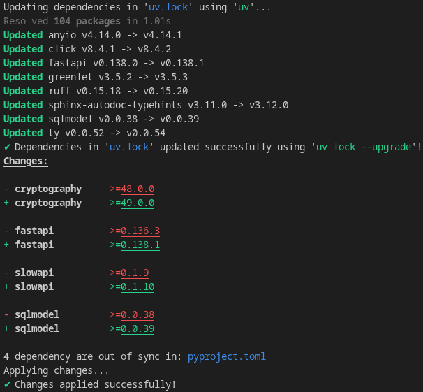

[](https://www.rust-lang.org/)
[](https://docs.astral.sh/uv/)
[](https://github.com/javidahmed64592/uv-bump/actions/workflows/ci.yml)
[](https://github.com/javidahmed64592/uv-bump/actions/workflows/docs.yml)
[](https://github.com/javidahmed64592/uv-bump/actions/workflows/release.yml)
[](https://www.gnu.org/licenses/gpl-3.0.en.html)

<!-- omit from toc -->
# uv-bump

`uv-bump` is a command-line tool that helps you keep your Python dependencies in sync between `pyproject.toml` and `uv.lock`.
It checks for out-of-sync dependencies and can update version constraints in `pyproject.toml` accordingly.

It is intended to be used with Python projects that are managed with `uv`.
When executing `uv lock --upgrade`, `uv` updates `uv.lock` with the latest resolved dependecies, but it does not update the version constraints in `pyproject.toml` accordingly.
`uv-bump` bridges this gap by checking for out-of-sync dependencies and updating the version constraints in `pyproject.toml` to match the resolved versions in `uv.lock`.

<!-- omit from toc -->
## Table of Contents
- [Quick Guide](#quick-guide)
- [Usage](#usage)
- [License](#license)


## Quick Guide

```sh
uv-bump -h      # Show help message
uv-bump --check # Check for out-of-sync dependencies between `pyproject.toml` and `uv.lock`
uv-bump -y      # Update any out-of-sync version constraints in `pyproject.toml`
uv-bump -yu     # Upgrade dependencies and update version constraints in `pyproject.toml`
```

Example output:



## Usage

```sh
Update dependency constraints using versions resolved by `uv`

Usage: uv-bump [OPTIONS] [PATH]

Arguments:
  [PATH]  Path to folder containing `pyproject.toml` and `uv.lock` files [default: .]

Options:
      --check    Show a diff of dependency updates without applying them
  -y, --yes      Automatically apply all changes without prompting
  -u, --upgrade  Upgrade dependencies in `uv.lock` with `uv`
  -h, --help     Print help
```

## License

This project is licensed under the GPL License - see the [LICENSE](LICENSE) file for details.
